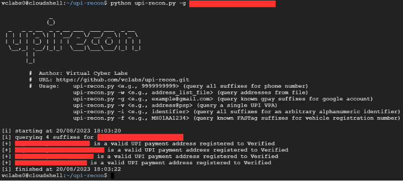

# upi-recon

**Update as of May 28, 2022:** As of now, Juspay has stripped the functionality of their API. The tool is currently not functional. This will be addressed in the next release.

**Update as of May 22, 2022:** The tool has limited functionality at the moment. This will be addressed in the next release. (https://github.com/qurbat/upi-recon/issues/22)

upi-recon is a command line tool for UPI payment address discovery and reconnaissance. The project was primarily created for demonstrating the range of correlated information that can be extracted from and along with Unified Payments Interface ("UPI") Virtual Payment Addresses.

The tool has support for several input types which can be used to obtain (and otherwise extrapolate) information associated with UPI virtual payment addresses.

## Requirements
`pip install -r requirements.txt`

## Usage
### Query all possible UPI addresses for the provided phone number
`upi-recon.py -p <phone_number>`
### Query all possible UPI addresses for the provided phone number using a specified number of threads
`upi-recon.py -p <phone_number> -t 5`
### Query a single UPI address for the provided VPA
`upi-recon.py -v <single_vpa>`
### Query all possible UPI addresses for the provided Gmail address
`upi-recon.py -g <gmail_username>`
### Query all possible FASTag addresses for a vehicle registration number
`upi-recon.py -f <vehicle_number>`
### Query all possible UPI addresses for a given term
`upi-recon.py -w <word>`
